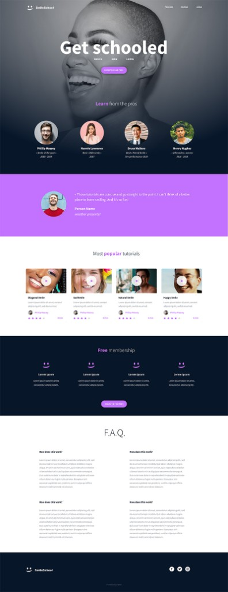
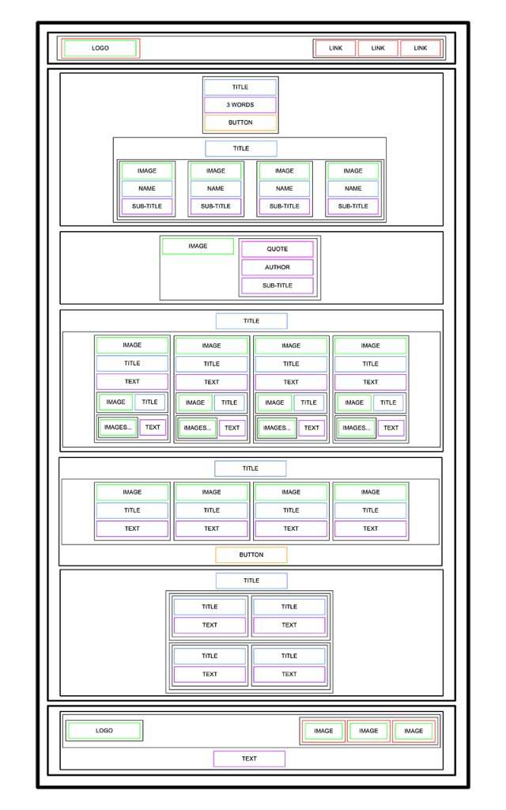

# SmileSchool

SmileSchool is a single webpage built from a designer wireframe. This project is the HTML structure only: semantic tags, no CSS and no external libraries. Styling comes in a later project.

The page is a school for smiling. It opens with a header and a banner, then a quote, popular video tutorials, a free membership offer, an FAQ, and a footer.

The layout follows this wireframe. Each colored box in the wireframe is a real HTML element in `index.html`: headings, paragraphs, images, buttons, a quote, and groups of links.

## Sections

- **Header** — clickable SmileSchool logo, plus links for courses, pricing, and login
- **Banner** — “Get schooled”, the words SMILES, GRIN, and LAUGH, a register button, and four instructors
- **Quote** — a portrait, the testimonial, the author, and a subtitle
- **Tutorials** — four videos, each with a picture, title, text, author, five stars, and a duration
- **Membership** — four benefits and a register button
- **FAQ** — two rows of two questions
- **Footer** — logo, social links, and the copyright line

## Files

- `index.html` — the page
- `images/` — pictures used by the page
- `smile-school-design.png` — the target design
- `smile-school-wireframe.png` — the structure the HTML follows

Open `index.html` in a browser to read the page. It will look plain until CSS is added.
